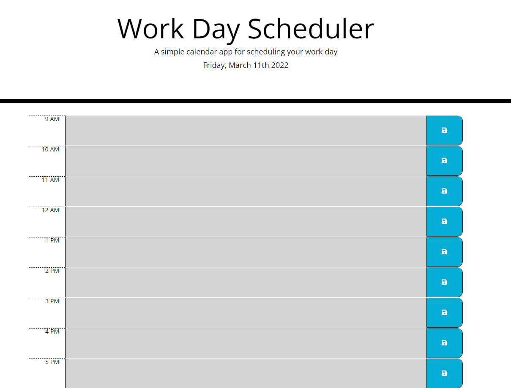

# Work-Daily-Planner

## Description

This app is a daily planner that allows the user to add tasks or activities to an hourly schedule based on the average American workday of 9am to 5pm.
The app is a good way to keep track of tasks for the current day and will show the user visual what tasks are upcoming and what has passed.

Access the app at:
https://github.com/Famesmyname/Work-Daily-Planner

## Intructions

To use the app simply type in any task/activities for the day into their respective times. The save button on the right side of each hour will save the task.
The current hour and associated task will be shown in red, upcoming tasks in green and past tasks are greyed out. The planner covers only the current day. The date is displayed on top.
The screenshot below shows the general layout of the app. Notice each hourly row has the time, task, and save button in that order.

Remember to save each hourly task so that even when the app/page is reopened, the save tasks are populated into their respective hours.

## Version History

1.00    -Release
1.01    -Fixed layout of hours to line up.

